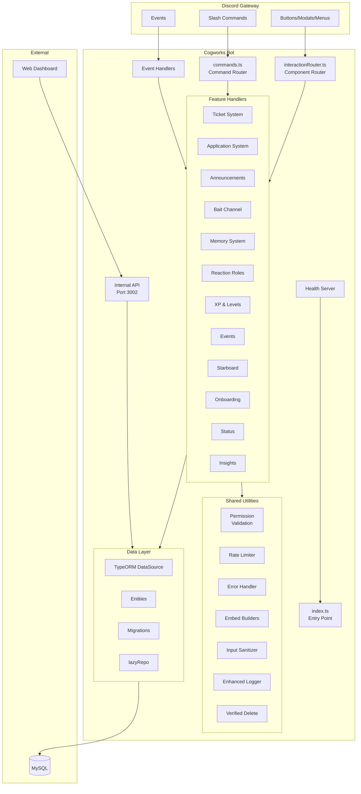
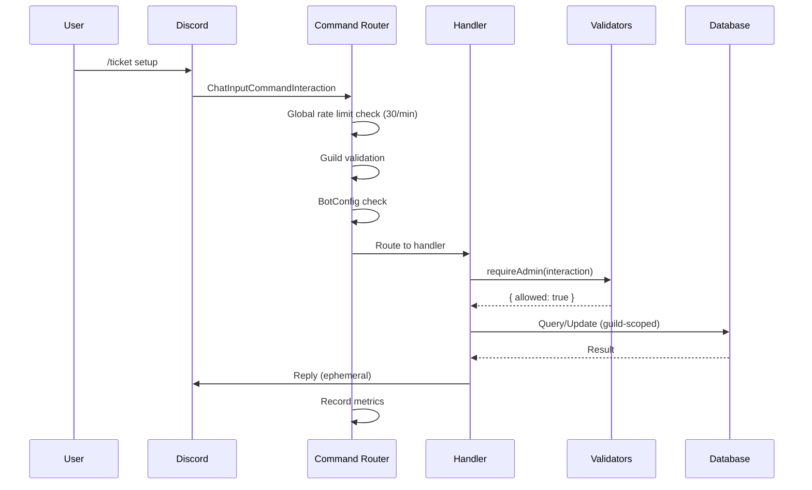
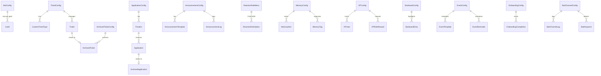
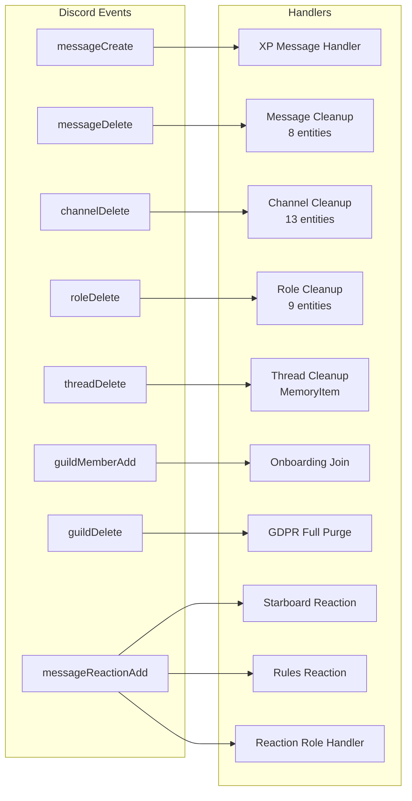
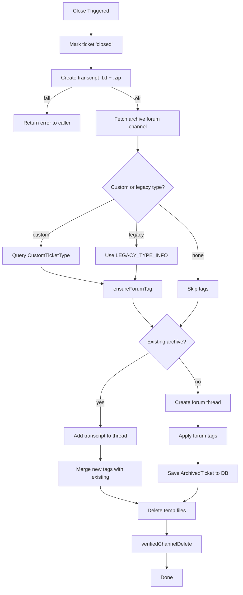

# Cogworks Bot — Architecture

## System Overview



## Command Flow



## Entity Relationships



## Event Handling



## Ticket Close Workflow



## Internal API

```
POST /internal/guilds/:guildId/<feature>/<action>
Authorization: Bearer <COGWORKS_INTERNAL_API_TOKEN>
```

Handlers registered in `src/utils/api/handlers/`:
- **tickets** — close, assign
- **applications** — list, review
- **announcements** — send
- **memory** — list, add
- **reactionRoles** — list, sync
- **setup** — dashboard state, system configuration
- **config** — bot config read/write
- **guilds** — guild info, member counts

## Key Design Decisions

| Decision | Rationale |
|----------|-----------|
| Guild-scoped everything | Multi-tenant safety — no cross-server data leaks |
| Discord-first deletion | Delete Discord objects before DB records to prevent orphans |
| `lazyRepo()` pattern | Deferred repository init avoids accessing DataSource before ready |
| Forum tag accumulation | Merge tags on existing posts, never replace |
| Verified deletion helpers | Returns `{ success, alreadyGone, error }` — "already gone" counts as success |
| `lang` module | Centralized strings enable future i18n |
| Rate limiting at multiple levels | User, guild, and global throttles prevent abuse |
| Shared close workflow | Single `archiveAndCloseTicket()` used by both event and API handlers |
