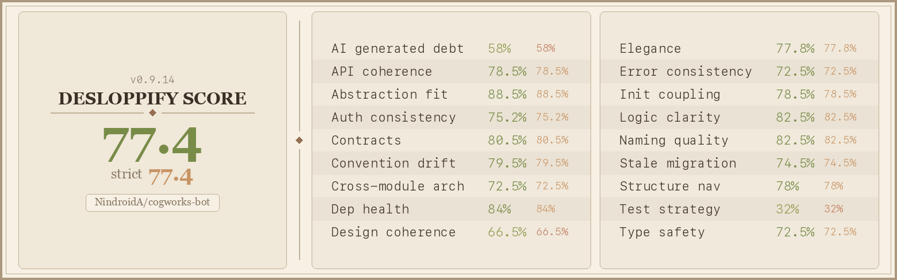

# Cogworks Bot

All-in-one Discord server management. Tickets, applications, XP, reaction roles, events, starboard, and more — with per-server data isolation.

<p>
  
  
  
  
  
  
</p>

[Home](https://cogworks.nindroidsystems.com) &bull; [Dashboard](https://cogworks.nindroidsystems.com/dashboard) &bull; [Discord](https://discord.gg/nkwMUaVSYH) &bull; [Commands](docs/commands.md) &bull; [Admin Guide](docs/admin_guide.md)

## Get Started

```
/bot-setup
```

Auto-detects your server's config, walks you through the rest, and creates channels matching your naming style.

## Features

<table>
<tr>
<td width="50%" valign="top">

**Tickets** — Custom types, workflow tracking, SLA, smart routing, auto-close, email import, forum archive

</td>
<td width="50%" valign="top">

**Applications** — Position-based forms, review pipeline, workflow statuses, forum archive

</td>
</tr>
<tr>
<td width="50%" valign="top">

**XP & Levels** — Message/voice XP, rank cards, leaderboard, role rewards, channel multipliers

</td>
<td width="50%" valign="top">

**Reaction Roles** — Emoji-to-role menus with normal, unique, and lock modes

</td>
</tr>
<tr>
<td width="50%" valign="top">

**Announcements** — Rich embed templates with placeholders, preview, auto-publish

</td>
<td width="50%" valign="top">

**Memory** — Forum-based tracker for bugs, features, suggestions with custom tags

</td>
</tr>
<tr>
<td width="50%" valign="top">

**Bait Channel** — Anti-bot detection with scoring, keywords, join velocity, graduated actions

</td>
<td width="50%" valign="top">

**Events** — Scheduled events, templates, automated reminders, RSVP tracking

</td>
</tr>
<tr>
<td width="50%" valign="top">

**Starboard** — Auto-highlight top messages, configurable threshold, random command

</td>
<td width="50%" valign="top">

**Onboarding** — Multi-step welcome flows, role assignment, completion tracking

</td>
</tr>
<tr>
<td width="50%" valign="top">

**Rules** — Reaction-based acknowledgment with automatic role assignment

</td>
<td width="50%" valign="top">

**Insights** — Activity snapshots, growth trends, channel heatmaps, digest reports

</td>
</tr>
</table>

Plus: AutoMod integration, context menus, outage status, role management, MEE6 import, data export, health monitoring, web dashboard, and GDPR-compliant auto-cleanup.

## Tech Stack

| Component | Technology |
|-----------|------------|
| Language | TypeScript 5.9 |
| Runtime | Bun (Node.js compatible) |
| Framework | Discord.js v14 |
| Database | MySQL + TypeORM |
| Deployment | Docker |
| Linting | Biome |
| Testing | Jest + ts-jest |
| Monitoring | Structured logging + HTTP health endpoints |

## Codebase Health



## Docs

| | |
|---|---|
| [Commands](docs/commands.md) | Full command reference |
| [Admin Guide](docs/admin_guide.md) | Setup and configuration |
| [Privacy Policy](docs/privacy_policy.md) | Data handling |
| [Terms of Service](docs/terms_of_service.md) | Usage terms |

## License

[PolyForm Noncommercial 1.0.0](LICENSE)

## Support

[Discord](https://discord.gg/nkwMUaVSYH) &bull; [Issues](https://github.com/NindroidA/cogworks-bot/issues) &bull; `/coffee` in Discord
